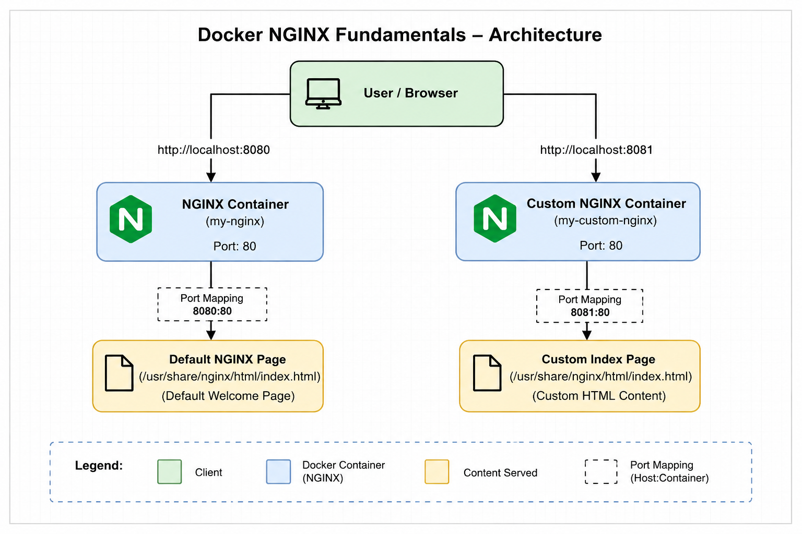

# Docker NGINX Fundamentals

A beginner-friendly Docker project demonstrating core containerization concepts by running the official NGINX image and building a custom Docker image that serves a personalized web page.

---

## Architecture



---

## Project Structure

```
docker-nginx-fundamentals/
├── Dockerfile
├── index.html
├── README.md
├── .gitignore
└── screenshots/
```

---

## Stack

| Component | Details |
|---|---|
| Platform | macOS |
| Container Runtime | Docker |
| Base Image | nginx:latest |
| Custom Content | HTML |

---

## Steps

### 1. Verify Docker

```bash
docker --version
```

### 2. Pull and Run the Official NGINX Image

```bash
docker pull nginx
docker run -d --name my-nginx -p 8080:80 nginx
```

| Flag | Purpose |
|---|---|
| `-d` | Run in detached (background) mode |
| `--name my-nginx` | Assign a name to the container |
| `-p 8080:80` | Map host port 8080 to container port 80 |

Access at `http://localhost:8080`.

### 3. Inspect and Debug

```bash
docker logs my-nginx       # View container logs
docker inspect my-nginx    # View network, ports, volumes, env vars
```

### 4. Build a Custom Image

Create `index.html`:

```html
<h1>Welcome to My Custom NGINX!</h1>
<p>This page is served from a custom Docker image.</p>
```

Create `Dockerfile`:

```dockerfile
FROM nginx:latest
COPY index.html /usr/share/nginx/html/index.html
EXPOSE 80
```

Build and run:

```bash
docker build -t my-nginx:custom .
docker run -d --name my-custom-nginx -p 8081:80 my-nginx:custom
```

Access at `http://localhost:8081`.

---

## Troubleshooting Exercises

**Port conflict:**

```bash
# This fails — port 8080 is already in use
docker run -d --name nginx2 -p 8080:80 nginx

# Fix — use a different host port
docker run -d --name nginx2 -p 8082:80 nginx
```

**Wrong file in Dockerfile:**

```dockerfile
# This fails at build time — file doesn't exist
COPY wrong-file.html /usr/share/nginx/html/index.html
```

Correct the filename and rebuild.

**Stop and restart a container:**

```bash
docker stop my-nginx    # Page becomes inaccessible
docker start my-nginx   # Page comes back
```

---

## Cleanup

```bash
docker stop my-nginx my-custom-nginx
docker rm my-nginx my-custom-nginx
docker rmi my-nginx:custom
```

---

## Key Learnings

- Difference between Docker images and containers
- Host-to-container port mapping
- Running containers in detached mode
- Viewing logs and inspecting container metadata
- Writing Dockerfile instructions (`FROM`, `COPY`, `EXPOSE`)
- How NGINX serves content from its document root
- Troubleshooting port conflicts and build errors
- Container lifecycle management

---

## Screenshots

| Screenshot | Description |
|---|---|
| `docker-version.png` | Docker installation verified |
| `docker-ps-nginx-container.png` | Running NGINX container |
| `default-nginx-page.png` | Default NGINX welcome page |
| `custom-nginx-page.png` | Custom page served from built image |

---

## Author

**Manik Singhal**
